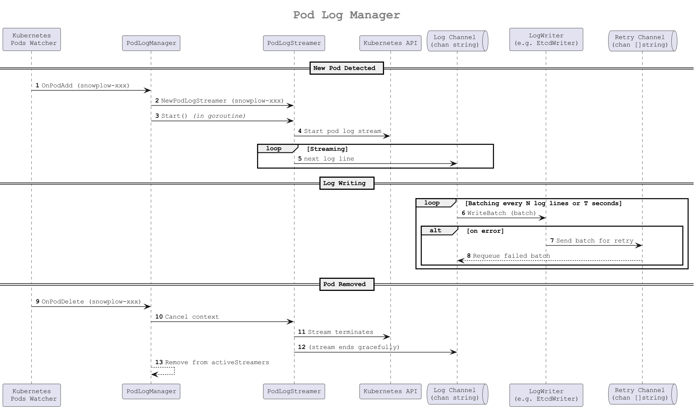

# `Frostbeat`

**`Frostbeat`** is a lightweight log streaming tool designed for Kubernetes environments. Its primary purpose is to collect structured logs (JSON format) from pods matching a specific label selector, and route them into a target backend such as a file or an `etcd` cluster.

> A prerequisite for using this tool is that logs must be structured as JSON objects, and must contain both a `"traceId": "..."` field and a `"time": "..."` field (in ISO 8601 format, e.g., _"2025-06-10T08:25:41.63070246Z"_).
> These fields are used to group logs and preserve their original event timestamp.

It supports:

* Real-time log streaming using the Kubernetes pod log API
* Grouping logs by `traceID` for correlation and traceability
* Buffered writing with batching and retry logic on failure
* Dynamic watching of pods: automatically starts/stops log streaming as pods appear or disappear
* Graceful shutdown with context and signal handling
* Pluggable writer interface - write logs to any destination, such as:
  - Etcd (**default**)
  - Files (local or mounted volume)
  - ElasticSearch
  - Kafka
  - Cloud storage (e.g. GCS, S3)
  - Any custom backend implementing the `LogWriter` interface

## How it works

1. At startup, it connects to the Kubernetes API and retrieves all pods matching a configured label.
2. It launches a dedicated **streamer** for each pod to consume logs in real-time.
3. Logs are sent to a buffered channel, where a **writer** component batches and persists them.
4. If write operations fail, the batch is retried via a dedicated channel.
5. A **pod watcher** observes for any new or terminated pods and updates the streaming set accordingly.

<br/>


<br/>

### Extending the `LogWriter`

Frostbeat uses a simple `LogWriter` interface:

```go
type LogWriter interface {
    WriteBatch(lines []string) error
}
```

This means you can easily plug in your own writer implementation to integrate with any external system.

For example:

* Write logs to ElasticSearch by implementing a writer that sends batched JSON via the bulk API.
* Push logs to Kafka or a cloud queue for async processing.
* Use a buffered channel-based writer for advanced processing pipelines.


## PodLogManager

The `PodLogManager` is the component responsible for managing the lifecycle of individual log streamers (`PodLogStreamer`) for Kubernetes pods. It serves as the bridge between the Kubernetes event stream (watcher) and the log ingestion pipeline.

### Purpose

* Dynamically responds to pod creation and deletion events.
* Starts a new `PodLogStreamer` for each relevant pod that appears.
* Gracefully stops and cleans up log streamers for pods that are removed.
* Maintains an internal map (`activeStreamers`) to track and manage running log streams.

### How it Fits in the Architecture

In the context of the overall system:

* The `Kubernetes Pods Watcher` detects new or deleted pods and notifies the `PodLogManager`.
* The `PodLogManager` creates or removes `PodLogStreamer` instances accordingly.
* Each `PodLogStreamer` opens a log stream from the Kubernetes API and pushes log lines to a shared log channel.
* A separate `LogWriter` component batches and persists logs to a destination (e.g., file, etcd, Elastic), consuming the shared channel.
* Failed batches are retried through a retry channel mechanism.

### Benefits

* Automatically scales with your deployments.
* Avoids log duplication or loss during pod lifecycle transitions.
* Keeps the main loop clean by encapsulating all pod log lifecycle logic.

<br/>



## Env Vars

| Environment Variable | Default Value     | Description                                                  |
|----------------------|-------------------|--------------------------------------------------------------|
| BATCH_SIZE           | 20                | Maximum number of log entries to send in a single batch.     |
| BATCH_PERIOD         | 5s                | Maximum time to wait before flushing a batch.                |
| NAMESPACE            | demo-system       | Kubernetes namespace to watch for pods and collect logs from.|
| SELECTOR             | app=snowplow      | Label selector to filter pods for log collection.            |
| ETCD_SERVERS         | localhost:2379    | Comma-separated list of etcd endpoints for log storage.      |
| TTL                  | 48h               | TTL (Time-To-Live) duration for keys stored in etcd.         |
